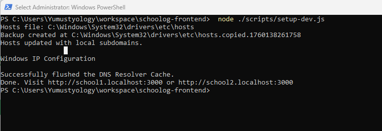

# Multi-tenant flow — local development

This document explains the flow and pieces we added to support multi-tenant (subdomain) local development.

## Goal
Let each school access the frontend at `https://<school>.localhost:3000` while sharing the same Next.js app.

## Main pieces added

1. `middleware.ts`
   - Detects the host (from `req.headers.host`).
   - If the request is for a subdomain (e.g., `school1.localhost`):
     - sets a cookie named `tenant` (value = subdomain)
     - sets a response header `x-tenant` with the subdomain value
   - If the request is for the global host (`localhost`):
     - disallows private routes (`/login`, `/dashboard`), redirecting to `/` if necessary
     - redirects `/school/:slug` to the subdomain `:slug.localhost`

2. `app/lib/tenant.ts`
   - Exports a typed `Tenant` and `getTenantFromHost(hostname)` to parse hostname into tenant info.

3. `app/lib/hooks/useSchoolContext.tsx`
   - A client hook that reads `window.location.hostname` and returns the tenant plus helpers:
     - `openSchool(slug)` — opens school subdomain in a new tab
     - `redirectToSchool(slug)` — navigates current window to school subdomain

4. `app/lib/config/axios.config.ts` (modified)
   - Axios request interceptor attaches `X-Tenant` to outgoing client requests (reads hostname via `getTenantFromHost`), so backend sees the tenant header on API calls.

5. `scripts/setup-dev.js`
   - Node-based helper to append local subdomain entries to the system hosts file and flush DNS cache.

Example output (screenshot):



6. README updates
   - Explains how to run the setup script and how the middleware works.

## How the request flow looks

- User opens `https://school1.localhost:3000` in browser.
- Next.js middleware runs on the edge for the incoming request and:
  - extracts subdomain `school1`
  - sets `tenant=school1` cookie and `x-tenant: school1` header on the response
- Client app bootstraps; axios interceptor attaches `X-Tenant: school1` to API calls.
- Backend receives API calls and reads `X-Tenant` or `tenant` cookie to scope DB calls to the correct tenant.

## NestJS backend (example)

- Read tenant in controllers or global middleware:

```ts
// in a Nest middleware or controller
const tenant = req.header('x-tenant') || req.cookies?.tenant;
```

- Recommended: Create a Nest middleware that normalizes the tenant and attaches it to the request (e.g., `req.tenant`) so services can access it without re-parsing headers.

## Development checklist

- Run `node ./scripts/setup-dev.js` (Admin/sudo required)
- Add `NEXT_PUBLIC_API_URL` to `.env.local` pointing at your backend
- Run `npm install` and `npm run dev`
- Visit `http://school1.localhost:3000`

## Notes and next steps

- Middleware cookie is convenient for server-side requests but ensure appropriate cookie attributes (Secure, SameSite) in production.
- In production, prefer deriving tenant from the request host (instead of trusting headers). Use production routing (wildcard domains or host header mapping) to serve multiple school domains.

*** End of document
